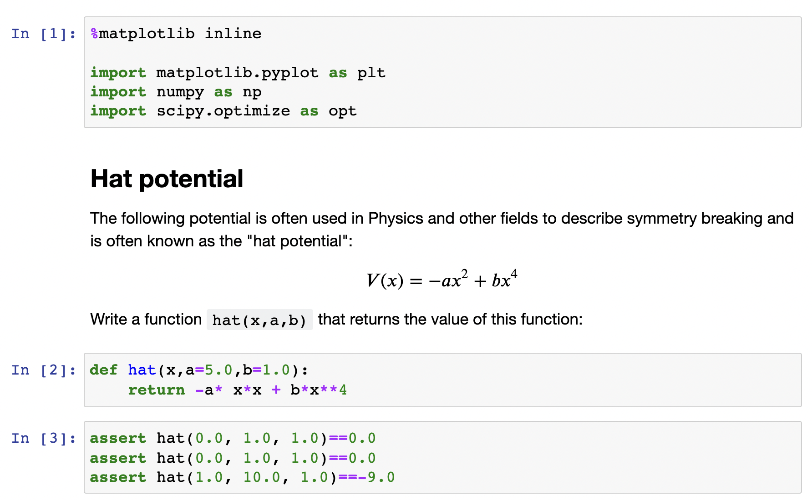

# Data Science Problems

Evaluate a natural language code generation model on real data science pedagogical notebooks! Data Science Problems (DSP) includes well-posed data science problems in Markdown along with unit tests to verify correctness and a Docker environment for reproducible execution. About 1/3 of notebooks in this benchmark also include data dependencies, so this benchmark not only can test a model's ability to chain together complex tasks, but also evaluate the solutions on real data! See our paper [Training and Evaluating a Jupyter Notebook Data Science Assistant](https://arxiv.org/abs/2201.12901) for more details about state of the art results and other properties of the dataset.

## Installation

This project requires Python 3.6+ and Docker to run. Assuming you have these, to get started first download and install the Python package:

```
$ git clone git@github.com:microsoft/DataScienceProblems.git
$ cd DataScienceProblems/src
$ pip install -e .
```

## Usage

### Reading the problems

Extract the `juice-github-repos.tar.gz` file from the `DataScienceProblems` repository.

```
$ tar -xvzf juice-github-repos.tar.gz
```

### Data Schema

Here is an example of a notebook context, prompt cell (1 and the markdown), solution cell (2), and unit tests cell (3).



The DSP schema corresponding to this example includes the `prompt` which is the question to be asked to the student, `solution` which is the answer to the question and `test` which is the test case to be run on the student's code.

```python
{
    'notebook_path': '/path/to/the/notebook.ipynb',
    'notebook_problem_index': 0,
    'prompt': '%matplotlib inline\n'
            'import matplotlib.pyplot as plt\n'
            'import numpy as np\n'
            'import scipy.optimize as opt\n'
            '## Hat potential\n'
            'The following potential is often used in Physics and other fields '
            'to describe symmetry breaking and is often known as the "hat '
            'potential":\n'
            '\n'
            '$$ V(x) = -a x^2 + b x^4 $$\n'
            '\n'
            'Write a function `hat(x,a,b)` that returns the value of this '
            'function:\n',
    'solution': 'def hat(x,a=5.0,b=1.0):\n    return -a* x*x + b*x**4',
    'task_id': 'DSP/414',
    'test': 'assert hat(0.0, 1.0, 1.0)==0.0\n'
            'assert hat(0.0, 1.0, 1.0)==0.0\n'
            'assert hat(1.0, 10.0, 1.0)==-9.0'
}
```

We provide a `read_problems` function that can be used to read the problems from the jupyter notebooks. 

Below is an example of how to use the `read_problems` function and use your generated code samples to save the samples to a file.


```python
from data_science_problems.read import read_problems
from data_science_problems.utils import write_jsonl

problems = read_problems()

num_samples = 1
samples = [
    dict(task_id=task_id, completion=generate_code(problems[task_id]["prompt"]))
    for task_id in problems
    for _ in range(num_samples)
]
write_jsonl("samples.jsonl", samples)
```


### Executing the problems and unit tests

Once you have saved the generated samples in the `samples.jsonl` file, you need to build the provided docker container, which would help you safely run the generated samples inside the container.

Use the following command to build the docker container.

```
$ docker build --pull --rm -f "Dockerfile" -t datascienceproblems:latest "."
```

Once the Docker container is built, you can execute the generated samples inside the container. You'll need to map the `/app/juice-github-repos` and `/samples/samples.jsonl` directory to the host directory where the notebooks are stored.

Use the following command to execute the samples inside the container.  

```
$ docker run -it --rm -v $PWD/juice-github-repos:/app/juice-github-repos -v $PWD/samples.jsonl:/samples/samples.jsonl datascienceproblems /samples/samples.jsonl
```


The `docker run` will perform the following things:

- It will read the samples from the `samples.jsonl` file.
- It will create new notebooks with the generated code samples. The list of new notebooks is saved in the `generates-notebooks.txt` file.
- It will execute these new notebooks.
- It will compute `pass@k` for generated samples. 

> **WARNING: Running the `docker run` command with `num_samples = 1` will create with ~1000 new notebooks and save them on your disk. This may take a while.**

```
$ docker run -it --rm -v $PWD/juice-github-repos:/app/juice-github-repos -v $PWD/samples.jsonl:/samples/samples.jsonl datascienceproblems /samples/samples.jsonl
2021-11-02 09:11:11,847 INFO services.py:1164 -- View the Ray dashboard at http://127.0.0.1:8265
Reading the generated samples.
100%|███████████████████████████████████████████████| 305/305 [00:03<00:00, 97.34it/s]
Saving to new notebooks with generated samples.
100%|███████████████████████████████████████████████| 305/305 [00:36<00:00,  8.47it/s]
Execute the new notebooks with generated samples.
100%|███████████████████████████████████████████████| 2192/2192 [05:17<00:40,  9.49it/s]
Complute pass@k for the executed notebooks.
100%|███████████████████████████████████████████████| 2192/2192 [00:28<00:00, 76.73it/s]
{'pass@1': ..., 'pass@10': ...}
```

##### Trademarks

> This project may contain trademarks or logos for projects, products, or services. Authorized use of Microsoft trademarks or logos is subject to and must follow Microsoft’s Trademark & Brand Guidelines. Use of Microsoft trademarks or logos in modified versions of this project must not cause confusion or imply Microsoft sponsorship. Any use of third-party trademarks or logos are subject to those third-party’s policies.

## Dataset Metadata

The following table is necessary for this dataset to be indexed by search
engines such as <a href="https://g.co/datasetsearch">Google Dataset Search</a>.
<div itemscope itemtype="http://schema.org/Dataset">
<table>
  <tr>
    <th>property</th>
    <th>value</th>
  </tr>
  <tr>
    <td>name</td>
    <td><code itemprop="name">Data Science Problems</code></td>
  </tr>
  <tr>
    <td>url</td>
    <td><code itemprop="url">https://github.com/microsoft/DataScienceProblems</code></td>
  </tr>
  <tr>
    <td>sameAs</td>
    <td><code itemprop="sameAs">https://github.com/microsoft/DataScienceProblems</code></td>
  </tr>
  <tr>
    <td>description</td>
    <td><code itemprop="description">
        Evaluate a natural language code generation model on real data science pedagogical notebooks! 
        Data Science Problems (DSP) includes well-posed data science problems in Markdown along with 
        unit tests to verify correctness and a Docker environment for reproducible execution. About 
        1/3 of notebooks in this benchmark also include data dependencies, so this benchmark not only 
        can test a model's ability to chain together complex tasks, but also evaluate the solutions 
        on real data! See our paper Training and Evaluating a Jupyter Notebook Data Science Assistant 
        (https://arxiv.org/abs/2201.12901) for more details about state of the art results and other 
        properties of the dataset.
	</code></td>
  </tr>
  <tr>
    <td>citation</td>
    <td><code itemprop="citation">https://arxiv.org/abs/2201.12901</code></td>
  </tr>
  <tr>
    <td>license</td>
    <td><code itemprop="license">https://github.com/microsoft/DataScienceProblems/blob/main/LICENSE.txt</code></td>
  </tr>
</table>
</div>

